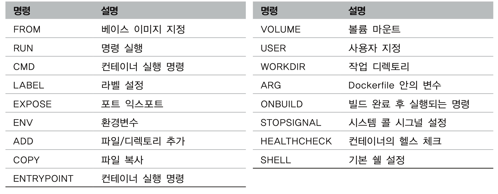
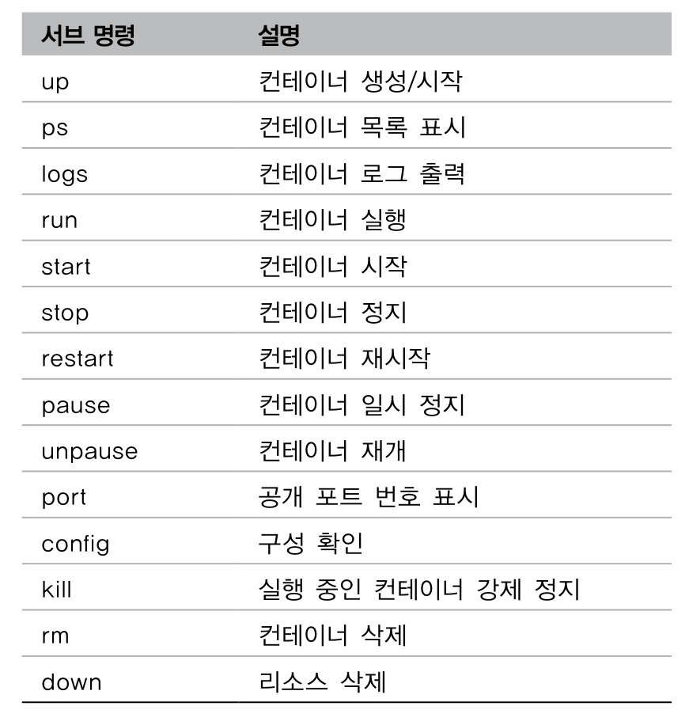

# Docker networking
* 도커 기본 네트워크
	* bridge
	* host
	* none
* overlay
* 참고
	* [사용하기 어려운 도커, 네트워크 종류부터 알아두자](https://www.boannews.com/media/view.asp?idx=55957)

## Bridge networking
* 호스트의 네트워크과 게스트의 네트워크를 브릿지하여(연결하여) 두 개의 네트워크를 하나의 네트워크처럼 사용하는 것
* 도커 기본 네트워킹 모드
* Docker가 시작되면 `docker0` 이라는 이름의 virtual 인터페이스를 만들어 컨테이너와 호스트 머신이 통신한다. `docker0` 인터페이스는 vitrual Ethernet bridge (데이터링크계층 프로토콜, 동일 네트워크 내의 네트워크 장비까지 전달받은 데이터를 운반)
* 디폴트: `--net=bridge`
* docker run 으로 컨테이너가 시작되면, docker0 의 IP주소공간에서 이 컨테이너의 IP가 할당됨. 그리고 `veth` 인터페이스가 2개 만들어져서 하나는 컨테이너에 할당되고, 하나는 `docker0` 브리지에 할당된다. 컨테이너 쪽에서는 이게 `eth0` 으로 보인다.
	* 컨테이너1의 eth0 – veth* – docker0 – 호스트의 eth0
* 참고
	* [NAT 와 Bridged Networking 개념 정리](http://itmore.tistory.com/entry/NAT-%EC%99%80-Bridged-Networking-%EA%B0%9C%EB%85%90-%EC%A0%95%EB%A6%AC)
	* [Docker 컨테이너 네트워크](https://sangwook.github.io/2015/01/16/docker-container-network.html)
	* [Docker Network 구조(1) - docker0와 container network 구조](http://bluese05.tistory.com/15)

## Host networking
* 도커 엔진과 같은 네트워크를 사용
* 호스트 네트워크를 사용하면 같은 엔진에서 같은 이미지 컨테이너를 여러개 동시에 띄우는 것이 힘든 단점
* 포트를 열고 닫는 조절이 힘든 보안상의 문제도 있지만, 성능이 좋아서 네트워크를 많이 사용하게 되는 경우 고려해 볼 수 있다.
	* 예: API gateway로 브리지 네트워크로 구성된 다른 컨테이너로 요청들을 라우팅해 줄 때

## No network
* 어떤 네트워크에도 연결이 안되어 있도록 컨테이너 설정도 가능하다. 보안상의 이유로 특정한 케이스에서 사용하게 될 수도...

## Overlay network
* 여러 호스트에 설치된 컨테이너끼리 연결하기 위해 사용
* Production 환경에서 고가용성 확보를 위해 필수적
* 이때, enterprise service bus로 모든 요청을 라우팅하는 것은 MSA에서 지양하고 있는 설계로, 기본적으로 모든 서비스는 스스로 service discovery 및 load balancing을 처리하는 것이 추천된다 (책 뒤에 다룰 예정)
* Docker overlay network은 물리적 네트워크 위에서 도커 머신끼리 데이터를 주고 받을 수 있게 도와준다.
* 단점: dynamic service registry에 의존적

* 참고:
	* [4. Service Discovery in a Microservices Architecture | KihoonKim:Dev](https://kihoonkim.github.io/2017/01/27/Microservices%20Architecture/Chris%20Richardson-NGINX%20Blog%20Summary/4.%20Service%20Discovery%20in%20a%20MSA/)
	* [사용하기 어려운 도커, 네트워크 종류부터 알아두자](https://www.boannews.com/media/view.asp?idx=55957)
> 분산된 네트워크에서 도커를 사용해야 할 때가 있다. 여러 호스트에 설치된 콘테이너들끼리 직접 통신을 해야만 하는 상황이다. 그럴 때는 overlay 네트워크가 해결책이다. 그러려면 먼저 도커 서버들의 swarm mode가 활성화되어 있어야 한다. swarm mode란 도커가 도커 엔진 다수(이를 swarm이라고 한다)를 관리할 수 있도록 해주는 방법이다. 이 모드를 활성화시켰다면 VXLAN 캡슐화를 사용해 layer 2 overlay 네트워크를 swarm 안에 만드는 게 가능해진다. 그런 후에 콘테이너를 overlay 네트워크에 추가하면 마치 모든 콘테이너가 같은 노드 안에 있는 것처럼 서로 간 직접 통신이 가능해진다. 외부에서 overlay 네트워크와 통신을 할 수 있도록 하려면 사용자가 정의한 bridge 네트워크에서처럼 설정하면 된다.  

## Custom network drivers
도커 컨테이너 네트워크 클러스터 생성해주는 역할
* https://www.weave.works/
* [Project Calico - Secure Networking for the Cloud Native Era](https://www.projectcalico.org/)
	* 여러 개의 data center간에 데이터를 주고 받을 때 유용하다

## Creating custom bridge network
* `$ docker network ls`
* custom network에 연결하기: 컨테이너 실행시 `--network=네트워크 이름` 명령어 추가


# Docker Dockerfile Docker-compose
## $ Docker build
도커 이미지 만들기

## $ Docker run 
이미지를 실제로 실행 -> 컨테이너 생성 및 실행

## Dockerfile
서버 구성을 문서화한 것 
* 베이스가 될 Docker 이미지
* Docker 컨테이너 안에서 수행한 조작 (명령)
* 환경변수 등의 설정
* Docker 컨테이너 안에서 작동시켜둘 데몬 실행

위와 같은 Docker 상에서 작동시킬 컨테이너 구성 정보를 기술하기 위한 파일 입니다.
Docker build 명령은 Dockerfile에 기술된 구성 정보를 바탕으로 Docker 이미지를 작성

### 기본 서식
명령 인수
```
FROM redis
```

### Dockerfile 명령



#### RUN 과 CMD / ENTRYPOINT 차이
* RUN 은 이미지 작성을 위해 실항하는 명령을 기술하지만 이미지를 바탕으로 생성된 컨테이너 안에서 명령을 실행하려면 CMD 명령을 사용 
* Dockerfile에는 하나의 CMD 만 작성 가능하며 여러개를 지정하면 마지막 명령만 유효
* ENTRYPOINT 는 CMD의 인수를 활용가능 하다

#### COPY / ADD 차이
ADD 명령은 원격 파일의 다운로드나 아카이브의 압축 해체 등과 같은 기능을 갖고 있지만 COPY 명령은 호스트랑의 파일을 이미지 안으로 복사하는 처리만 가능합니다. 

## Docker-compose
여러 컨테이너를 모아서 관리하기 위한 툴
* YAML 형식의 파일로 관리
```

version: '3.3'
services:
  # WebServer config
  webserver:
    build: . #docker context 위치 (dockerfile 위치)
    ports:
     - "80:80" #dockerfile expose
    depends_on:
     - redis

  # Redis config
  redis:
    image: redis:4.0
```

### 주요 서브 명령어




### 컨테이너 시작
```
$ docker-compose up
```

### 컨테이너 정지
```
#정지
$ docker-compose stop

#docker compose 에서 이용한 리소스를 삭제
# docker-compose down
```


#build-microservice-with-go/chapter3 #docker	#docker-compose

